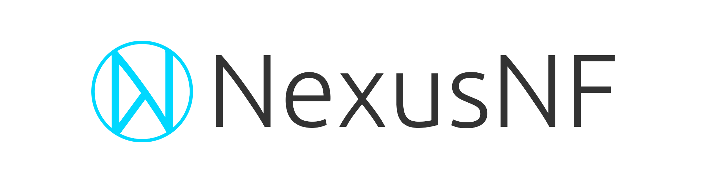

# Nexus NF

---

<p align="center">

</p>
<p align="center">
A lightweight, declarative framework for building robust and type-safe microservices with NATS.
</p>
<p align="center">
<a href="https://www.npmjs.com/package/nexus-nf"></a>
<a href="https://www.npmjs.com/package/nexus-nf"></a>
<a href="https://github.com/Spaxterr/nexus-nf/blob/main/LICENSE"></a>
<a href="https://spaxterr.github.io/nexus-nf/docs"></a>
</p>

---

Nexus NF or Nexus NATS Framework is a lightweight and easy-to-use framework for
building NATS microservices using TypeScript. Nexus utilizes NATS's built-in
[service API](https://docs.nats.io/using-nats/developer/services) to register
services, endpoint groups and endpoints.

> ⚠️ **Project Status**: Nexus NF is currently in active development. Stability
> is a major focus, but breaking changes and bugs may occur. Please provide
> feedback and report issues on
> [GitHub](https://github.com/Spaxterr/nexus-nf/issues/new).

## Features

- **Flexibility**: Nexus NF does not impose or enforce a specific design
  pattern, giving you the flexibility to build services in your own way.
- **TypeScript Support**: Full type-safety included.
- **Data Validation**: Built-in support for data validation with Zod schemas.
- **NATS Service Integration**: Build on the NATS service API and
  request-response patterns, offering discovery, monitoring and load balancing
  out of the box.
- **Standardized Responses**: Consistent response format for both successful
  messages and errors.

## Installation

Use the project generator to quickly set-up and install a Nexus NF project.

```bash
npx create-nexus-service
```

## Implementation

```typescript
import { connect } from 'nats';
import { NexusApp, ControllerBase, Endpoint } from 'nexus-nf';
import { z } from 'zod';

// Define a schema
const addSchema = z.object({
    a: z.number(),
    b: z.number(),
});

// Create a controller
class MathController extends ControllerBase {
    constructor() {
        super('math', { queue: 'math-queue' });
    }

    @Endpoint('add', { schema: addSchema })
    async add(data: z.infer<typeof addSchema>) {
        return { result: data.a + data.b };
    }

    @Endpoint('multiply')
    async multiply(data: { a: number; b: number }) {
        return { result: data.a * data.b };
    }
}

// Initialize and run
async function main() {
    const nc = await connect({ servers: 'nats://localhost:4222' });

    const service = await nc.services.add({
        name: 'math-service',
        version: '1.0.0',
    });

    const app = new NexusApp(nc, service);
    app.registerController(new MathController());
}

main();
```

### Making Requests

```bash
nats request "math.add" '{"a": 5, "b": 3}'
```

```json
{ "error": false, "data": { "result": 8 } }
```

## Response Format

All endpoints return standardized responses:

**Success:**

```json
{
    "error": false,
    "data": { "result": 8 }
}
```

**Error:**

```json
{
  "error": true,
  "message": "Bad Request: Validation failed.",
  "code": "400",
  "details": [...]
}
```

## Documentation

For complete documentation, visit
**[the documentation site](https://spaxterr.github.io/nexus-nf/docs)**.

- [Getting Started](https://spaxterr.github.io/nexus-nf/docs)
- [Controllers](https://spaxterr.github.io/nexus-nf/docs/controllers)
- [Validation](https://spaxterr.github.io/nexus-nf/docs/validation)
- [Error Handling](https://spaxterr.github.io/nexus-nf/docs/error-handling)

## Contribution Guide

- **Fork** the repository on GitHub.
- **Clone** your forked repository: `git clone <link to fork repository>
- **Create a feature branch**: `git checkout -b feature/my-awesome-feature`
- **Install dependencies**: `npm install`
- **Make your changes**.
- **Run tests**: `npm test`
- **Commit and push** your changes to your fork.
- Open a [**Pull Request**](https://github.com/Spaxterr/nexus-nf/pulls) to the
  main branch of the original repository.

## Links

- [NPM Package](https://www.npmjs.com/package/nexus-nf)
- [GitHub Repository](https://github.com/Spaxterr/nexus-nf)
- [API Documentation](https://spaxterr.github.io/nexus-nf/docs)
